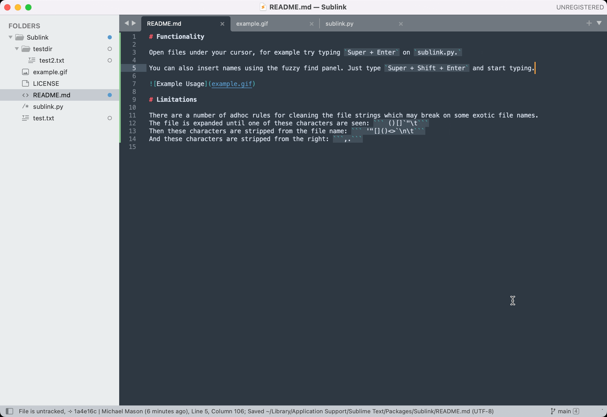

# Functionality

Open files under your cursor, for example try typing `Super + Enter` on `sublink.py.`

You can also insert names using the fuzzy find panel. Just type `Super + Shift + Enter` and start typing.

[Main implementation](sublink.py)



# Limitations

There are a number of adhoc rules for cleaning the file strings which may break on some exotic file names.
The file is expanded until one of these characters are seen: ``` ()[]`"\t```
Then these characters are stripped from the file name: ``` '"[]()<>`\n\t```
And these characters are stripped from the right: ```,.```
